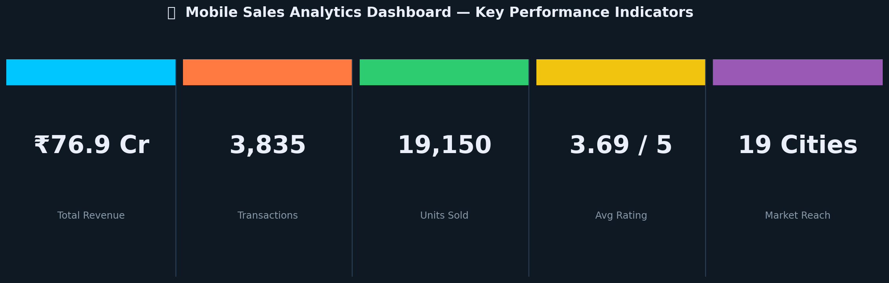
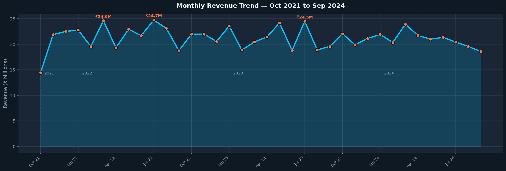
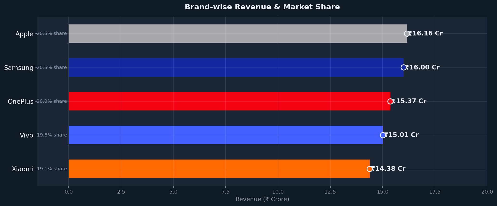
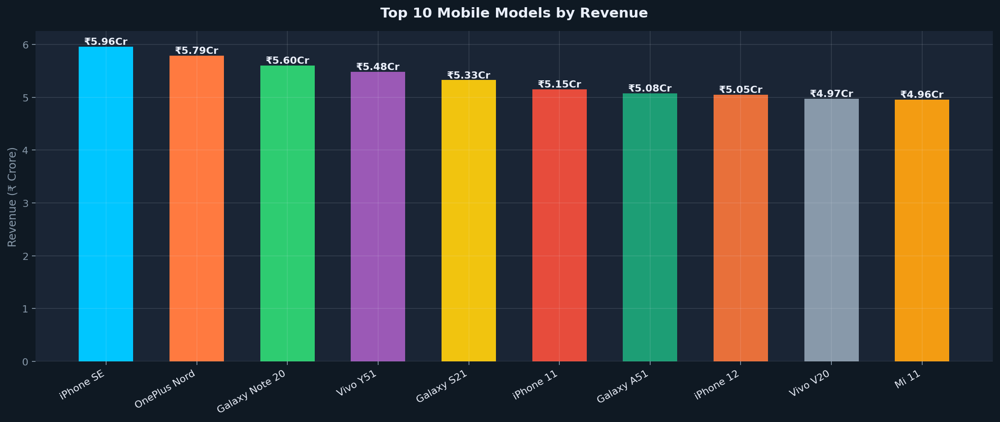
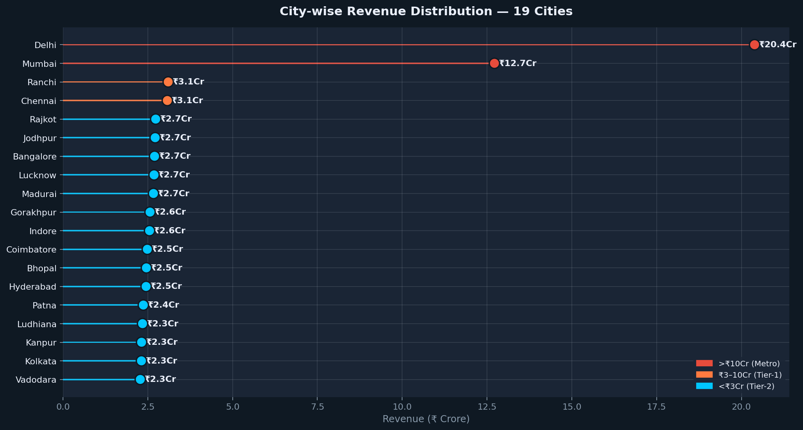
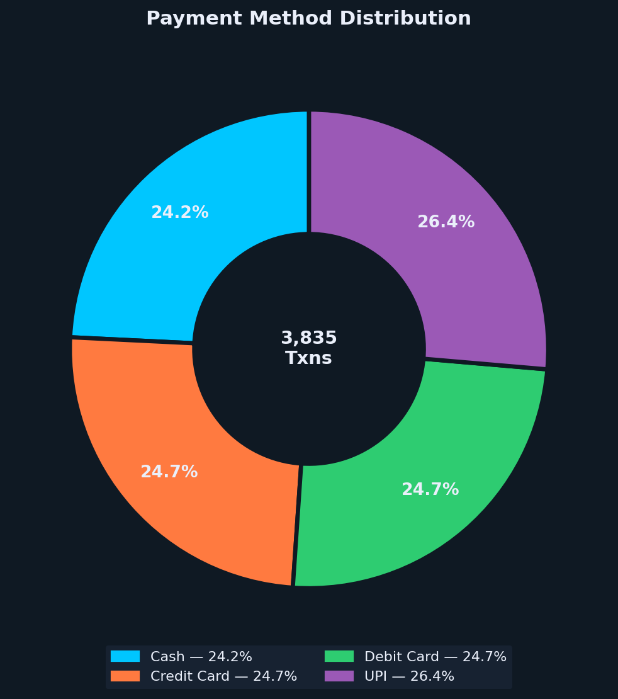
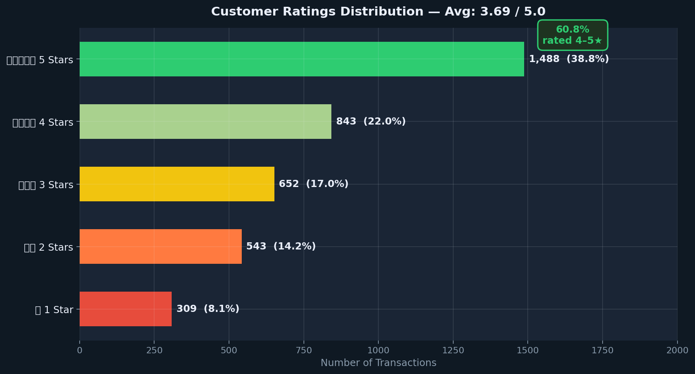
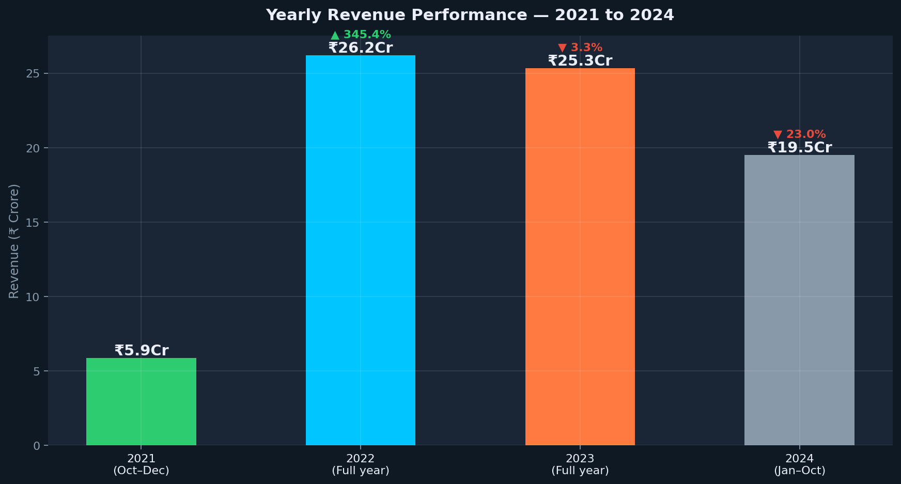
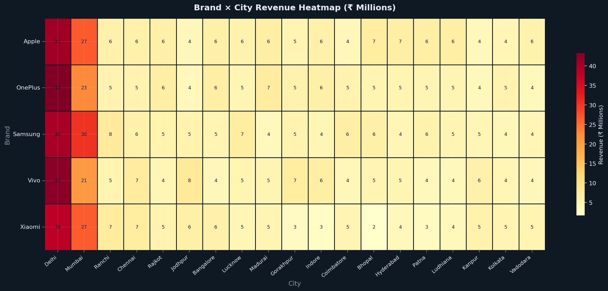
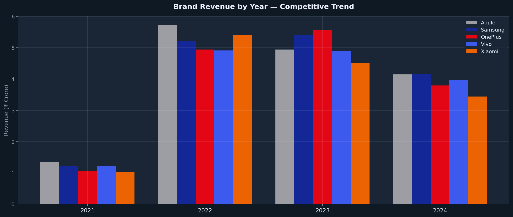

# 📱 Mobile Sales Analytics Dashboard
### Revenue Trends, Brand Performance & Market Intelligence — India 2021–2024

> **Turning 3,835 transactions into a decision-ready sales strategy** | Power BI · Python · EDA · Data Visualization

---


---

### 🏷️ Keywords
`Sales Analytics` · `Power BI Dashboard` · `Revenue Analysis` · `Exploratory Data Analysis` · `KPI Tracking` · `Data Visualization` · `Market Intelligence` · `Data Cleaning & Transformation` · `Business Insights` · `Python`

---

## 📌 Business Problem

The mobile phone market moves fast. New models launch every quarter, consumer preferences shift with each product cycle, and sales teams are often the last to know when a trend has already peaked. Without real-time visibility into *what's selling, where, and to whom* — decisions get made on instinct rather than evidence.

This project transforms raw transactional data from **3,835 sales records across 19 Indian cities (2021–2024)** into a decision-ready analytics dashboard that any business leader can navigate and act on.

---

## 🎯 Objective

Build a complete mobile sales analytics solution that:
- Tracks revenue KPIs across brands, models, cities, and time periods
- Surfaces brand performance trends and model-level revenue rankings
- Identifies geographic demand concentration and growth markets
- Provides actionable business recommendations backed by 3+ years of real data

---

## 📊 Dataset Description

| Property | Details |
|---|---|
| **File** | `Mobile_Sales_Data.xlsx` |
| **Records** | 3,835 transactions |
| **Period** | October 2021 — October 2024 |
| **Features** | 14 columns — Brand, Units Sold, Price Per Unit, City, Payment Method, Customer Age, Customer Ratings, Mobile Model |
| **Brands** | Apple · Samsung · OnePlus · Vivo · Xiaomi |
| **Cities** | 19 cities across India |
| **Derived Feature** | `Revenue = Units Sold × Price Per Unit` |

---

## 🛠 Tools & Technologies

| Layer | Stack |
|---|---|
| **Dashboard & Reporting** | Power BI — DAX, KPI cards, slicers, drill-throughs |
| **Exploratory Data Analysis** | Python — Pandas, NumPy |
| **Data Visualization** | Matplotlib, Seaborn |
| **Data Cleaning** | Revenue derivation, date parsing, feature engineering |
| **Version Control** | Git & GitHub |

---

## 🔍 Analysis Approach

1. **Data Ingestion & Cleaning** — Validated 14 columns. Zero missing values confirmed. Derived `Revenue` column and parsed date fields for time-series analysis.
2. **Brand & Model Benchmarking** — Ranked all 5 brands on revenue, units sold, and transaction volume. Identified top 10 revenue-driving models.
3. **Geographic Intelligence** — Mapped revenue across 19 cities. Quantified metro concentration vs. Tier-2 growth opportunity.
4. **Time-Series Analysis** — 36-month trend analysis surfacing seasonality, peaks, and year-over-year performance.
5. **Customer Behavior Analysis** — Payment preferences, ratings distribution, and age-group revenue segmentation.
6. **Power BI Dashboard** — Interactive dashboard with brand/city filters, KPI cards, and model-level drill-through.

---

## 📈 Key Insights

- 💰 **Total revenue: ₹76.9 Crore** across 3,835 transactions and 19,150 units — 2021 to 2024
- 🏙️ **Delhi alone: ₹20.4 Cr (26.5%)** followed by Mumbai at ₹12.7 Cr — two cities = 43% of total revenue, high concentration risk
- 📱 **iPhone SE tops all models at ₹5.96 Cr** — mid-range value positioning beats premium flagships
- ⚖️ **All 5 brands hold ~20% unit share** — revenue differentiation is driven by average selling price, not volume
- 💳 **UPI leads payment methods at 26.4%** — cash still 24.2%, revealing a dual digital-traditional buyer landscape
- ⭐ **60.8% rated 4–5 stars** (avg 3.69/5) — strong satisfaction with a 22.3% low-rating segment to address
- 📅 **March–May and July = consistent revenue peaks** — predictable seasonality enables proactive inventory planning
- 🏘️ **Tier-2 cities (Ranchi, Rajkot, Jodhpur) generating ₹2.7 Cr+ each** — matching Bangalore, signaling untapped growth

---

## 📊 Dashboard & Visualizations

### 🔢 KPI Summary — Business at a Glance



*Five headline metrics: total revenue, transaction count, units sold, customer satisfaction, and geographic reach.*

---

### 📈 Monthly Revenue Trend — 36-Month Performance



*Consistent monthly revenue in the ₹19–25M band with clear seasonal peaks in March–May and July. No major dips over 3 years — a resilient market.*

---

### 🏷️ Brand Revenue & Market Share



*Apple leads at ₹16.2 Cr but holds only a ₹0.5 Cr edge over Samsung. Unit share is near-identical across all 5 brands — differentiation is purely on average selling price.*

---

### 📱 Top 10 Mobile Models by Revenue



*iPhone SE (₹5.96 Cr) leads. OnePlus Nord and Galaxy Note 20 follow closely. Samsung holds 3 of the top 10 spots.*

---

### 🏙️ City-wise Revenue Distribution — 19 Cities



*Delhi (₹20.4 Cr) and Mumbai (₹12.7 Cr) dominate. Tier-2 cities show revenue parity at ₹2.7–3.1 Cr — the next growth frontier.*

---

### 💳 Payment Method Distribution



*UPI tops at 26.4% confirming India's digital shift. Cash still 24.2% — Tier-2 city buyers drive traditional payment preference.*

---

### ⭐ Customer Ratings Distribution



*5-star ratings (38.8%) most common. 60.8% rated 4–5 stars. The 22.3% low-rating cluster (1–2 stars) needs a brand and city-level deep dive.*

---

### 📅 Yearly Revenue Performance



*2022 was peak at ₹26.2 Cr. 2023 held at ₹25.3 Cr. 2024 (through October) on pace for ~₹23 Cr annualized.*

---

### 🔥 Brand × City Revenue Heatmap



*Delhi drives revenue for all 5 brands. OnePlus punches above its weight in Tier-2 cities like Ranchi and Lucknow.*

---

### 📊 Brand Revenue Trend by Year



*All brands peaked in 2022 and held steady through 2023. Apple maintained the narrowest year-over-year decline.*

---

## 💡 Business Recommendations

1. **Reduce Delhi–Mumbai revenue concentration.** Tier-2 cities at ₹2.7 Cr+ each with likely lower customer acquisition cost. Allocate 15–20% more marketing budget there.
2. **Prioritize mid-range model inventory.** iPhone SE (₹5.96 Cr) and OnePlus Nord (₹5.79 Cr) are where volume and margin intersect. Stock-out events in this tier cost real revenue.
3. **Build UPI-first loyalty programs.** 26.4% digital adoption growing — UPI cashback rewards improve retention and repeat purchase frequency.
4. **Investigate the 22.3% low-rating cluster.** Segment 1–2 star reviews by brand and city to isolate product, delivery, or service failures before they scale.
5. **Pre-load inventory for March–May and July peaks.** Stock up 3–4 weeks early on high-demand models to prevent lost sales during seasonal surges.

---

## 📂 Project Structure

```
mobile-sales-analytics-dashboard/
│
├── 📁 dashboard/
│   └── sales_data.pbix
│
├── 📁 data/
│   └── Mobile_Sales_Data.xlsx
│
├── 📁 notebooks/
│   └── Mobile_Sales_EDA.ipynb
│
├── 📁 scripts/
│   └── generate_visuals.py
│
├── 📁 images/
│   ├── 01_kpi_banner.png
│   ├── 02_monthly_trend.png
│   ├── 03_brand_revenue.png
│   ├── 04_top_models.png
│   ├── 05_city_revenue.png
│   ├── 06_payment_donut.png
│   ├── 07_customer_ratings.png
│   ├── 08_yearly_revenue.png
│   ├── 09_brand_city_heatmap.png
│   └── 10_brand_year_trend.png
│
├── 📁 docs/
│   └── Mobile_Sales_Insights_Report.pdf
│
├── requirements.txt
└── README.md
```

---

## 🚀 How to Run

```bash
# 1. Clone the repository
git clone https://github.com/surya-prakash-data-analyst/mobile-sales-analytics-dashboard.git
cd mobile-sales-analytics-dashboard

# 2. Install dependencies
pip install -r requirements.txt

# 3. Run EDA notebook
jupyter notebook notebooks/Mobile_Sales_EDA.ipynb

# 4. Regenerate charts
python scripts/generate_visuals.py

# 5. Open Power BI dashboard
# Power BI Desktop → File → Open → dashboard/sales_data.pbix
```

---

## 📬 Contact

**Surya Prakash** — Data Analyst  
📍 Hyderabad, India  
🔗 [LinkedIn](https://www.linkedin.com/in/surya-prakash-data-analyst) · 🐙 [GitHub](https://github.com/surya-prakash-data-analyst)  
📧 *suryaprakash1892@gmail.com*

---

> *"Sales data is just noise until you know what questions to ask. This dashboard was built to ask the right ones — automatically, every time."*

---
*Built with real data · 3,835 transactions · 19 cities · 5 brands · 3 years · Insights verified.*
