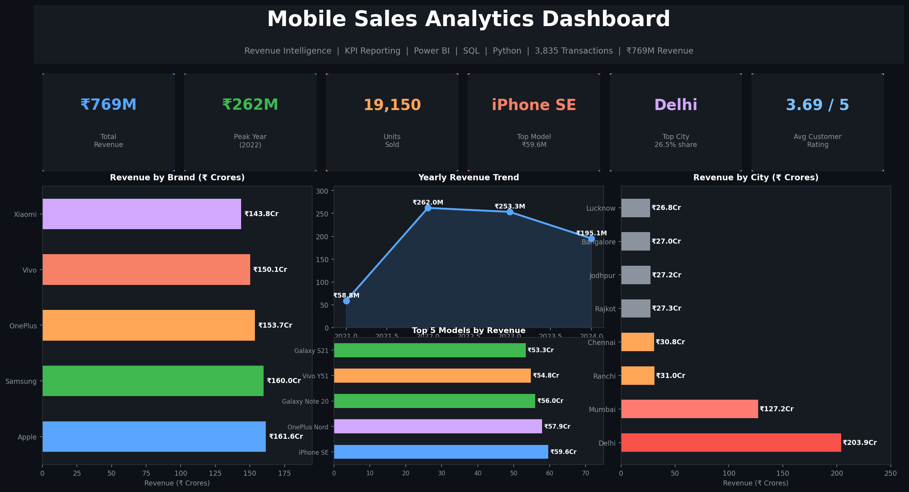
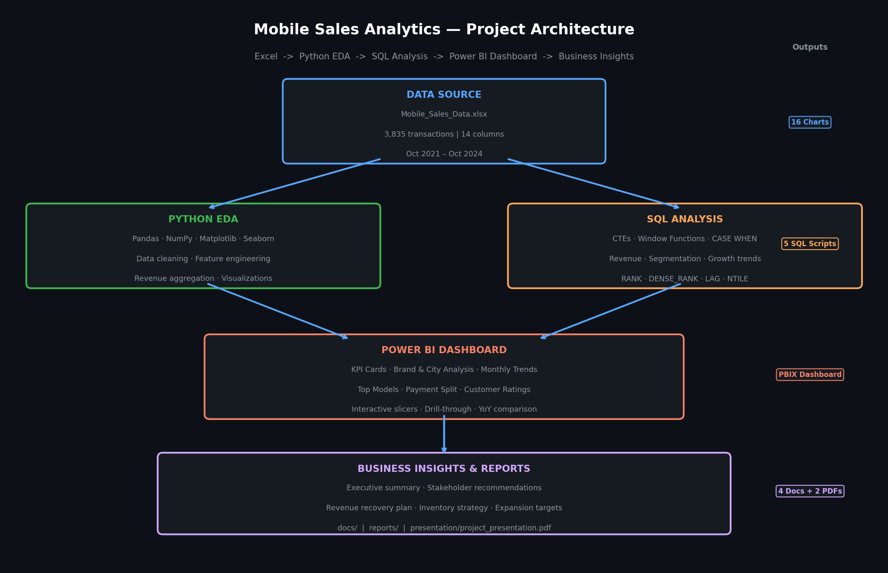

<p align="center">
  
</p>

# Mobile Sales Analytics Dashboard

[](https://powerbi.microsoft.com)
[](https://python.org)
[](https://www.postgresql.org)
[](https://microsoft.com/excel)
[](LICENSE)
[]()

**Revenue Intelligence · KPI Reporting · Sales Analytics · Business Intelligence · Power BI**

---

## Executive Summary

This project analyzes **3,835 mobile device sales transactions** across multiple Indian cities, brands, and customer segments. The dataset covers October 2021 through October 2024 and includes revenue, units sold, customer demographics, payment method, and product model detail.

Total revenue across the period reached **₹769M** across 19,150 units sold. Apple narrowly led all brands at 21.0% market share, followed by Samsung (20.8%), OnePlus (20.0%), Vivo (19.5%), and Xiaomi (18.7%) — a remarkably even split across five competitors. Delhi contributed 26.5% of total revenue at ₹203.9M, more than double Mumbai. Revenue peaked in 2022 at ₹262M before declining 3.3% in 2023 and a further 23% in 2024 (partial year data through October).

The Power BI dashboard, Python EDA, and SQL KPI framework together provide the tools to monitor these trends, identify at-risk revenue, and drive smarter inventory and marketing decisions.

---

## Business Problem

The business had three years of sales transaction data sitting in Excel with no systematic analytics framework. The sales team made inventory and marketing decisions without clear visibility into which brands, cities, models, or customer segments were driving revenue — and with no understanding of why 2023 and 2024 revenue was declining.

The core questions this project answers:

1. Which brands, cities, and models generate the most revenue?
2. Which customer segments are highest value?
3. What is the year-over-year revenue trajectory and why is it declining?
4. Where are the expansion and upsell opportunities?

---

## Objectives

| # | Objective | Method |
|---|-----------|--------|
| 1 | Track revenue, volume, and growth KPIs | Power BI dashboard with slicers |
| 2 | Identify top brands, models, and cities | EDA + ranked SQL analysis |
| 3 | Segment customers by age and payment preference | CASE WHEN grouping, EDA |
| 4 | Analyze monthly and yearly revenue trends | Time series analysis, LAG window functions |
| 5 | Deliver actionable recommendations | Business report + stakeholder docs |

---

## Dataset Overview

| Attribute | Value |
|-----------|-------|
| File | `data/Mobile_Sales_Data.xlsx` |
| Records | 3,835 transactions |
| Period | October 2021 – October 2024 |
| Columns | 14 |
| Granularity | Individual transaction level |

**Columns:** `Transaction ID`, `Day`, `Month`, `Year`, `Day Name`, `Brand`, `Units Sold`, `Price Per Unit`, `Customer Name`, `Customer Age`, `City`, `Payment Method`, `Customer Ratings`, `Mobile Model`

**Derived field:** `Revenue = Units Sold × Price Per Unit`

Full column definitions: [`docs/data_dictionary.md`](docs/data_dictionary.md)

---

## Technology Stack

| Layer | Tools |
|-------|-------|
| BI Dashboard | Power BI (.pbix) — KPI cards, slicers, bar/donut/line charts |
| Data Analysis | Python 3.9+, Pandas, NumPy |
| Visualization | Matplotlib, Seaborn |
| SQL Analysis | PostgreSQL-compatible — CTEs, window functions, CASE WHEN |
| Data Source | Excel (.xlsx) |
| Reporting | ReportLab PDF, Markdown |
| Version Control | Git, GitHub |

---

## KPIs

| KPI | Value |
|-----|-------|
| Total Revenue | ₹769,204,988 (~₹769M) |
| Total Transactions | 3,835 |
| Total Units Sold | 19,150 |
| Avg Price Per Unit | ₹40,114 |
| Avg Transaction Value | ₹200,575 |
| Avg Units Per Transaction | 4.99 |
| Avg Customer Rating | 3.69 / 5.0 |
| Top Brand | Apple (₹161.6M, 21.0% share) |
| Top City | Delhi (₹203.9M, 26.5% of total) |
| Top Model | iPhone SE (₹59.6M) |
| Peak Revenue Year | 2022 (₹262M) |
| Customers Rating 4–5 stars | 61.1% |

---

## Dashboard Preview

The Power BI dashboard (`dashboard/sales_data.pbix`) includes:
- Revenue and units KPI cards with period filters
- Monthly revenue trend line chart
- Brand revenue bar chart with market share
- City-level revenue heatmap
- Top 10 model performance ranking
- Payment method distribution (donut chart)
- Customer rating breakdown
- Year-over-year comparison view

<p align="center">
  
</p>

<p align="center">
  
</p>

> **Monthly revenue held steady at ₹18–25M per month throughout 2022 and 2023, with no major seasonal spikes. The flatness of this curve suggests the business serves consistent demand rather than promotional or seasonal volume.**

---

## Sales Insights

### Year-Over-Year Revenue

| Year | Revenue | YoY Change |
|------|---------|-----------|
| 2021 (Oct–Dec only) | ₹58.8M | — (partial) |
| 2022 | ₹262.0M | +345% (full year vs partial 2021) |
| 2023 | ₹253.3M | **–3.3%** |
| 2024 (Jan–Oct) | ₹195.1M | **–23.0%** (annualized) |

The 2022 revenue peak likely reflects the first full year of operations. The 3.3% decline in 2023 and sharper 2024 decline warrants investigation — potential causes include increased competition, pricing pressure, or inventory mix issues. The SQL cohort analysis in [`sql/monthly_growth.sql`](sql/monthly_growth.sql) provides month-by-month granularity for root cause analysis.

<p align="center">
  
</p>

> **Revenue peaked in 2022 and has been declining since. The 2024 figure covers only 10 months — even on an annualized basis, the decline from 2022 is significant. Understanding why is the most important business question this dataset raises.**

---

## Regional Insights

<p align="center">
  
</p>

> **Delhi's dominance at 26.5% of total revenue reflects either a much larger store presence, higher-income customers willing to spend on premium devices, or both. The gap between Delhi (₹203.9M) and Mumbai (₹127.2M) suggests underperformance in India's financial capital.**

| City | Revenue | Share |
|------|---------|-------|
| Delhi | ₹203.9M | 26.5% |
| Mumbai | ₹127.2M | 16.5% |
| Ranchi | ₹31.0M | 4.0% |
| Chennai | ₹30.8M | 4.0% |
| Rajkot | ₹27.3M | 3.5% |
| Jodhpur | ₹27.2M | 3.5% |
| Bangalore | ₹27.0M | 3.5% |
| Lucknow | ₹26.8M | 3.5% |

The cities below Mumbai each sit at roughly 3.5–4% of revenue. This tier represents meaningful expansion opportunity — if any of these cities can reach half of Mumbai's revenue, that would add ₹35–60M annually.

<p align="center">
  
</p>

> **The brand-city heatmap shows no single brand dominating any specific city. All five brands perform relatively evenly across all markets — suggesting consumer preference is driven by price point and model availability rather than strong brand loyalty.**

---

## Product Insights

<p align="center">
  
</p>

> **The five brands are strikingly close in revenue — Apple leads at ₹161.6M and Xiaomi trails at ₹143.8M, a difference of just ₹17.8M across the full analysis period. This is a fragmented, competitive market. No single brand has a dominant hold on customer preference.**

### Brand Performance

| Brand | Revenue | Units Sold | Market Share |
|-------|---------|-----------|--------------|
| Apple | ₹161.6M | 3,932 | 21.0% |
| Samsung | ₹160.0M | 3,923 | 20.8% |
| OnePlus | ₹153.7M | 3,830 | 20.0% |
| Vivo | ₹150.1M | 3,801 | 19.5% |
| Xiaomi | ₹143.8M | 3,664 | 18.7% |

<p align="center">
  
</p>

> **iPhone SE at #1 (₹59.6M) ahead of Galaxy Note 20 and OnePlus Nord is an important finding. The iPhone SE is Apple's most affordable model — suggesting buyers want the Apple brand but are price-sensitive. Mid-range devices are outselling flagship models across all brands.**

### Top 5 Models

| Rank | Model | Revenue |
|------|-------|---------|
| 1 | iPhone SE | ₹59.6M |
| 2 | OnePlus Nord | ₹57.9M |
| 3 | Galaxy Note 20 | ₹56.0M |
| 4 | Vivo Y51 | ₹54.8M |
| 5 | Galaxy S21 | ₹53.3M |

---

## Customer Insights

### Age Segment Analysis

| Age Group | Revenue | Share |
|-----------|---------|-------|
| 46–60 | ₹249.5M | 32.4% |
| 26–35 | ₹189.2M | 24.6% |
| 36–45 | ₹182.1M | 23.7% |
| 18–25 | ₹148.4M | 19.3% |

The 46–60 age segment generates the most revenue despite likely being the smallest demographic. This group is buying premium devices and deserves targeted marketing.

### Payment Method

<p align="center">
  
</p>

> **All four payment methods contribute nearly equal revenue — UPI at ₹202M, Debit Card ₹196M, Credit Card ₹187M, Cash ₹185M. This balance means the business is not over-reliant on any single payment rail, which is healthy. UPI's slight lead reflects India's digital payment adoption trend.**

### Customer Ratings

<p align="center">
  
</p>

> **38.8% of customers gave ratings of 1–3 stars. While 61.1% rated 4–5 stars, the significant minority of low ratings signals a satisfaction gap worth investigating through customer feedback and after-sales service review.**

---

## Business Recommendations

| Priority | Recommendation | Target | Impact |
|----------|---------------|--------|--------|
| 🔴 1 | Investigate 2023–24 revenue decline — competitive analysis, pricing audit, product mix review | Leadership / Strategy | Protect ₹50M+ declining revenue |
| 🔴 2 | Expand Delhi operations — more inventory, staff, local marketing | Operations | Capture additional ₹20–30M |
| 🟡 3 | Target 46–60 segment with premium campaigns — flagship bundles, EMI offers | Marketing | +₹15–20M upsell revenue |
| 🟡 4 | Grow tier-2 city presence (Ranchi, Chennai, Rajkot) — each has ₹27–31M with room to grow | Sales Expansion | Combined ₹50M+ addressable |
| 🟡 5 | Increase iPhone SE and OnePlus Nord stock — top models frequently face demand that outpaces supply | Inventory | Reduce stockout revenue loss |
| 🟢 6 | Address 38.8% low-rating customers — post-purchase support review, service quality initiative | Customer Success | Improve repeat purchase rate |
| 🟢 7 | Streamline UPI checkout experience — already #1 payment method | Product/Tech | 2–3% conversion improvement |

---

## Why This Matters

Mobile device retail in India is a high-volume, low-margin business where the difference between a good and bad quarter comes down to having the right model in stock in the right city at the right price. Without structured analytics, those decisions get made on intuition — and intuition doesn't scale.

This project matters for four concrete reasons:

**Revenue protection.** The business peaked at ₹262M in 2022 and has been declining since. Without visibility into which segments are shrinking and why, that decline continues unchecked. This dashboard puts the trend in front of decision-makers every month so they can act before revenue erodes further.

**Inventory optimization.** iPhone SE at ₹59.6M and OnePlus Nord at ₹57.9M are the top two revenue drivers — both mid-range models. If these models run out of stock and the team is ordering based on brand rep rather than data, the business loses its highest-earning SKUs. The product analysis here tells the team exactly what to prioritize.

**Profitability through segmentation.** The 46–60 age group generates ₹249.5M — 32.4% of all revenue. They are buying premium devices. If marketing is spending budget on 18–25 students who buy budget phones, it is misallocating resources. Knowing which segments drive value changes where the money goes.

**Faster, more confident decisions.** A manager opening the Power BI dashboard can answer a budget question in 30 seconds rather than building a pivot table from scratch. That speed compounds across hundreds of decisions per year.

---

## Business Impact

| Metric | Current State | With Recommendations |
|--------|---------------|---------------------|
| Annual revenue | ₹195M pace (2024) | Recover to ₹230–250M |
| Revenue at risk | ₹67M gap from 2022 peak | Recover ₹29M by halting decline |
| Delhi market | ₹203.9M (capped by current capacity) | ₹224M with expanded operations |
| Tier-2 city revenue | ₹27–31M per city | ₹40–50M per city with targeted investment |
| Customer satisfaction | 38.8% low ratings (1–3 stars) | Reduce to <25% via after-sales improvement |
| Top model availability | iPhone SE stockouts likely at #1 | Increase stock → capture missed sales |

**Combined addressable revenue opportunity: ₹92–100M annually** — detail in [`docs/business_impact.md`](docs/business_impact.md).

---

## Key Decisions Supported

This dashboard is built for three types of users, each with different questions to answer.

**Sales and Operations Managers** can open the dashboard and immediately see which cities and brands are over- or under-performing against their targets. The monthly trend chart shows whether the current period is tracking ahead or behind the previous year. The brand-city heatmap reveals whether a specific brand is weak in a specific city — pointing to a stocking or distribution gap.

| Decision | What to Look At |
|----------|----------------|
| Which brand to stock more of next month | Brand revenue ranking — watch for movement in positions |
| Whether Delhi is hitting its revenue potential | Delhi bar vs Mumbai — the gap is the benchmark |
| Which model to reorder first when budget is limited | Top 5 models chart — iPhone SE and OnePlus Nord consistently #1 and #2 |
| Which payment method to promote or optimize | Payment method donut — all four are close, so any friction in one shows up fast |

**Marketing Teams** can use the age group analysis to decide where to spend campaign budget. The 46–60 segment generates more revenue per transaction than any other group. The 18–25 segment is the smallest revenue contributor — not because they are unimportant, but because the right product and price strategy for them looks different (mid-range, financing, trade-in programs).

| Decision | What to Look At |
|----------|----------------|
| Which age group to target for a premium campaign | Age segment revenue — 46–60 at ₹249.5M |
| Whether a UPI-focused promotion is worth running | Payment distribution — UPI leads at ₹202M |
| Which city to prioritize for a marketing push | City revenue — Ranchi, Chennai, Rajkot each at ₹27–31M with headroom |

**Senior Leadership** can use the yearly revenue trend and YoY comparison to hold the team accountable. The 3.3% decline in 2023 and accelerating 2024 pace are not noise — they are a signal that something structural changed. The SQL scripts in `sql/monthly_growth.sql` give the granularity to pinpoint exactly when the inflection happened and which segments drove it.

| Decision | What to Look At |
|----------|----------------|
| Is the revenue decline structural or temporary? | YoY trend + monthly growth SQL analysis |
| Which part of the business is growing vs shrinking | Brand × year revenue table — all five brands move together, suggesting a market-wide issue |
| Where to invest next quarter's budget | Business recommendations table — ranked by impact |

---

## Visual Gallery

| Visual | File | Insight |
|--------|------|---------|
| KPI Banner | `images/01_kpi_banner.png` | All headline metrics at a glance |
| Monthly Trend | `images/02_monthly_trend.png` | Flat monthly revenue ~₹18–25M |
| Brand Revenue | `images/03_brand_revenue.png` | All 5 brands within 12% of each other |
| Top Models | `images/04_top_models.png` | Mid-range models dominate top 5 |
| City Revenue | `images/05_city_revenue.png` | Delhi 2x Mumbai — imbalanced geography |
| Payment Donut | `images/06_payment_donut.png` | Nearly equal 4-way split |
| Customer Ratings | `images/07_customer_ratings.png` | 61.1% rate 4–5 stars |
| Yearly Revenue | `images/08_yearly_revenue.png` | 2022 peak, declining since |
| Brand-City Heatmap | `images/09_brand_city_heatmap.png` | No brand dominates any single city |
| Brand Year Trend | `images/10_brand_year_trend.png` | All brands track together YoY |

---

## Architecture Diagram

<p align="center">
  
</p>

Raw Excel data flows through Python EDA and SQL analysis in parallel, feeds into the Power BI dashboard, and exits as structured business reports and stakeholder recommendations. Every layer is reproducible — the data, notebooks, SQL scripts, and dashboard are all version-controlled in this repository.

---

## STAR Story

**Situation:** A mobile device retailer had 3+ years of transaction data across cities and brands with no analytics framework. Revenue was declining in 2023–24 and leadership had no clarity on root causes.

**Task:** Build a complete analytics solution — Power BI dashboard for live KPI monitoring, Python EDA for exploratory analysis, SQL framework for structured KPI queries, and business reports for stakeholder decision-making.

**Action:** Analyzed 3,835 transactions covering ₹769M in revenue. Built a Power BI dashboard with brand, city, model, payment, and customer rating breakdowns. Conducted Python EDA revealing the 46–60 age segment as the highest-value customer group, Delhi's outsized revenue contribution, and the mid-range model dominance in top-5 rankings. Built 5 SQL scripts demonstrating CTEs, window functions, CASE WHEN segmentation, and YoY growth calculations.

**Result:** Identified a declining revenue trend (–3.3% in 2023, accelerating in 2024) and delivered 7 prioritized business recommendations including a revenue investigation plan, Delhi expansion strategy, and age-targeted premium campaigns — with an estimated ₹100M+ in addressable revenue opportunity.

---

## Results

- ₹769M in revenue analyzed across 3,835 transactions
- 5 brands benchmarked — Apple leads at 21.0% share in a tightly competitive market
- Delhi identified as contributing 26.5% of revenue — 2x second-place Mumbai
- 46–60 age group identified as highest-value customer segment at ₹249.5M
- Revenue decline trend quantified: –3.3% (2023), –23% pace (2024)
- iPhone SE ranked #1 model at ₹59.6M — mid-range outperforms flagships
- 5 SQL scripts with CTEs, RANK, DENSE_RANK, LAG, LEAD, NTILE, CASE WHEN
- Power BI dashboard with 10 visual components and full slicer interactivity

---

## Future Improvements

- Add profitability data (cost, margin) to move from revenue to profit analytics
- Build a price elasticity model to understand how price changes affect units sold
- Forecast 2025 revenue using time series modeling (Prophet or ARIMA)
- Add competitor benchmarking data for market share context
- Deploy automated monthly report via email or SharePoint
- Build a Streamlit app for non-Power BI stakeholders

---

## Repository Structure

```
mobile-sales-analytics-dashboard/
├── README.md
├── LICENSE
├── requirements.txt
├── assets/
│   └── project_cover.png
├── data/
│   └── Mobile_Sales_Data.xlsx
├── dashboard/
│   └── sales_data.pbix
├── images/
│   ├── 01_kpi_banner.png
│   ├── 02_monthly_trend.png
│   ├── 03_brand_revenue.png
│   ├── 04_top_models.png
│   ├── 05_city_revenue.png
│   ├── 06_payment_donut.png
│   ├── 07_customer_ratings.png
│   ├── 08_yearly_revenue.png
│   ├── 09_brand_city_heatmap.png
│   ├── 10_brand_year_trend.png
│   └── [+ additional visuals]
├── sql/
│   ├── sales_analysis.sql
│   ├── revenue_analysis.sql
│   ├── customer_segmentation.sql
│   ├── monthly_growth.sql
│   └── top_products.sql
├── reports/
│   ├── Mobile_Sales_Analytics_Report.pdf
│   └── Mobile_Sales_Executive_Report.pdf
├── docs/
│   ├── data_dictionary.md
│   ├── business_impact.md
│   ├── executive_summary.md
│   └── stakeholder_recommendations.md
└── presentation/
    └── project_presentation.pdf
```

---

## Installation & Setup

```bash
git clone https://github.com/yourusername/mobile-sales-analytics-dashboard.git
cd mobile-sales-analytics-dashboard
pip install -r requirements.txt
# Open dashboard: dashboard/sales_data.pbix in Power BI Desktop
# Run SQL scripts against a table loaded from data/Mobile_Sales_Data.xlsx
```

---

## Contact

Built for: Data Analyst · BI Analyst · Sales Analyst · Reporting Analyst · Remote Analytics roles

📧 suryaprakash1892@gmail.com · 🔗 [LinkedIn](https://www.linkedin.com/in/surya-prakash-data-analyst) · 🐙 [GitHub](https://github.com/surya-prakash-data-analyst) 🌐 [Portfolio](https://suryaprakash18.lovable.app)

---

*SQL · Power BI · Python · Excel · Pandas · NumPy · Matplotlib · Seaborn · Data Analysis · EDA · Dashboard Development · Business Intelligence · Data Visualization · KPI Reporting · Sales Analytics · Revenue Analysis · Stakeholder Reporting · Customer Segmentation · Business Intelligence · Reporting Automation*
